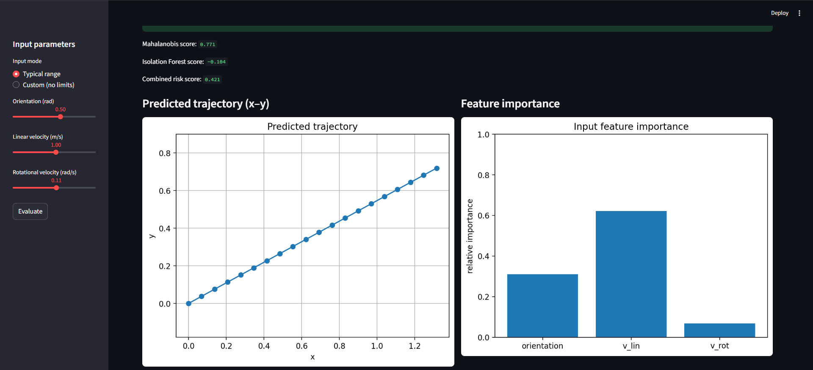
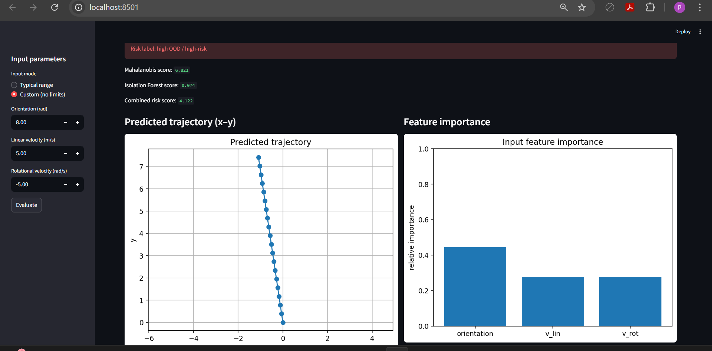
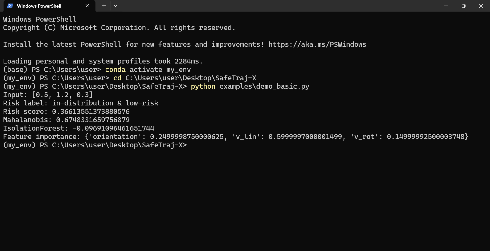

# SafeTraj-X

SafeTraj-X is a lightweight and modular framework for **trajectory prediction**, **out-of-distribution (OOD) detection**, and **risk estimation** in mobile robots and smart wheelchairs.

Modern robotic systems must decide whether a motion command is **safe**, **unusual**, or **potentially dangerous** before moving.  
This safety layer is essential for navigation, but it is often hidden inside large projects or spread across notebooks.

**SafeTraj-X makes this entire safety process simple, explicit, and reproducible.**
## 🔍 Why This Project?

Robots and autonomous mobility devices operate in unpredictable environments.  
A small change in orientation or velocity can push the system into behaviors it was **not trained for**.

SafeTraj-X provides a clear and modular way to explore:

- how a motion command translates into a trajectory  
- whether the command is “in-distribution” or anomalous  
- how risky the predicted behavior is  
- which input contributed most to the risk  

The goal is not high-fidelity simulation.  
The goal is **clarity, modularity, and safety-awareness** — a clean foundation that can be extended for research, prototyping, or safety validation.

## ✨ Features

### • Trajectory Prediction
Predicts a simple kinematic trajectory `[x(t), y(t), θ(t)]` based on the input command.

### • OOD Detection
Two independent detectors:
- Mahalanobis distance (empirical covariance)
- Isolation Forest anomaly score

### • Risk Estimation
Both OOD scores are normalized to `[0, 1]` and combined into:
- `risk_score`
- `risk_label` (low-risk, borderline, high-risk)

### • Explainability
Lightweight feature-importance showing which input contributed most to the risk.

### • Interactive Dashboard
Streamlit sliders → real-time trajectory → real-time risk evaluation.

## 📷 Dashboard Preview

### Low-risk example

A typical motion command inside the training range with a smooth trajectory and a **low-risk** label.



### High-risk / OOD example

A motion command far outside the training range, flagged with higher OOD scores and a **high-risk** label.



---

## 🖥 CLI Example

Example output from the command-line interface:




## 📦 Installation

Clone the project:

```bash
git clone https://github.com/pouyapd/SafeTraj-X.git
cd SafeTraj-X
```

Install dependencies:

```bash
pip install -r requirements.txt
pip install -e .
```

Run the interactive dashboard:

```bash
streamlit run dashboard/app.py
```


